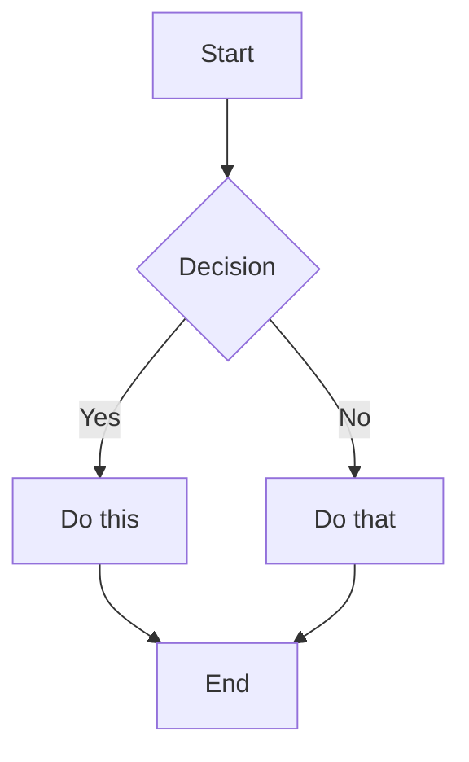
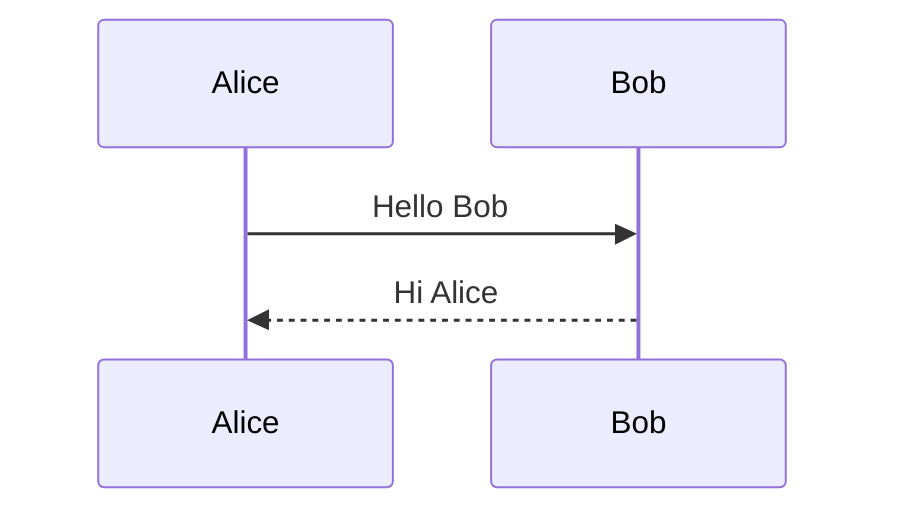
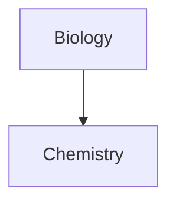
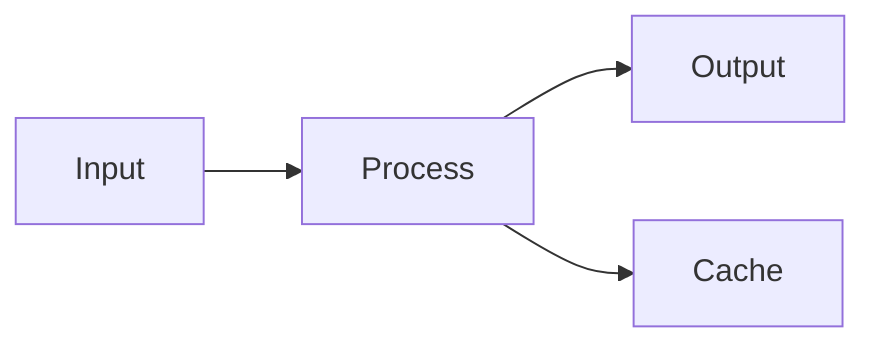

# Obsidian Flavored Markdown Skill

此 skill 使 agents 能够创建和编辑有效的 Obsidian Flavored Markdown，包括所有 Obsidian 特定的语法扩展。

## 概述

Obsidian 使用多种 Markdown 风格的组合：
- [CommonMark](https://commonmark.org/)
- [GitHub Flavored Markdown](https://github.github.com/gfm/)
- [LaTeX](https://www.latex-project.org/) 用于数学公式
- Obsidian 特定的扩展（wikilinks、callouts、embeds 等）

## 基本格式

### 段落和换行

```markdown
This is a paragraph.

This is another paragraph (blank line between creates separate paragraphs).

For a line break within a paragraph, add two spaces at the end
or use Shift+Enter.
```

### 标题

```markdown
# Heading 1
## Heading 2
### Heading 3
#### Heading 4
##### Heading 5
###### Heading 6
```

### 文本格式

| 样式 | 语法 | 示例 | 输出 |
|-------|--------|---------|--------|
| 粗体 | `**text**` 或 `__text__` | `**Bold**` | **Bold** |
| 斜体 | `*text*` 或 `_text_` | `*Italic*` | *Italic* |
| 粗体 + 斜体 | `***text***` | `***Both***` | ***Both*** |
| 删除线 | `~~text~~` | `~~Striked~~` | ~~Striked~~ |
| 高亮 | `==text==` | `==Highlighted==` | ==Highlighted== |
| 行内代码 | `` `code` `` | `` `code` `` | `code` |

### 转义格式

使用反斜杠转义特殊字符：

```markdown
\*This won't be italic\*
\#This won't be a heading
1\. This won't be a list item
```

常见需要转义的字符：`\*`, `\_`, `\#`, `` \` ``, `\|`, `\~`

## 内部链接 (Wikilinks)

### 基本链接

```markdown
[[Note Name]]
[[Note Name.md]]
[[Note Name|Display Text]]
```

### 链接到标题

```markdown
[[Note Name#Heading]]
[[Note Name#Heading|Custom Text]]
[[#Heading in same note]]
[[##Search all headings in vault]]
```

### 链接到块

```markdown
[[Note Name#^block-id]]
[[Note Name#^block-id|Custom Text]]
```

通过在段落末尾添加 `^block-id` 来定义块 ID：

```markdown
This is a paragraph that can be linked to. ^my-block-id
```

对于列表和引用，在单独一行添加块 ID：

```markdown
> This is a quote
> With multiple lines

^quote-id
```

### 搜索链接

```markdown
[[##heading]]     搜索包含 "heading" 的 headings
[[^^block]]       搜索包含 "block" 的 blocks
```

## Markdown 风格链接

```markdown
[Display Text](Note%20Name.md)
[Display Text](Note%20Name.md#Heading)
[Display Text](https://example.com)
[Note](obsidian://open?vault=VaultName&file=Note.md)
```

注意：Markdown 链接中的空格必须 URL 编码为 `%20`。

## Embeds

### Embed 笔记

```markdown
![[Note Name]]
![[Note Name#Heading]]
![[Note Name#^block-id]]
```

### Embed 图片

```markdown
![[image.png]]
![[image.png|640x480]]    宽度 x 高度
![[image.png|300]]        仅宽度（保持长宽比）
```

### 外部图片

```markdown


```

### Embed 音频

```markdown
![[audio.mp3]]
![[audio.ogg]]
```

### Embed PDF

```markdown
![[document.pdf]]
![[document.pdf#page=3]]
![[document.pdf#height=400]]
```

### Embed 列表

```markdown
![[Note#^list-id]]
```

其中列表已用块 ID 定义：

```markdown
- Item 1
- Item 2
- Item 3

^list-id
```

### Embed 搜索结果

````markdown
```query
tag:#project status:done
```
````

## Callouts

### 基本 Callout

```markdown
> [!note]
> This is a note callout.

> [!info] Custom Title
> This callout has a custom title.

> [!tip] Title Only
```

### 可折叠 Callouts

```markdown
> [!faq]- 默认折叠
> This content is hidden until expanded.

> [!faq]+ 默认展开
> This content is visible but can be collapsed.
```

### 嵌套 Callouts

```markdown
> [!question] 外层 callout
> > [!note] 内层 callout
> > Nested content
```

### 支持的 Callout 类型

| 类型 | 别名 | 描述 |
|------|---------|-------------|
| `note` | - | 蓝色，铅笔图标 |
| `abstract` | `summary`, `tldr` | 青色，剪贴板图标 |
| `info` | - | 蓝色，信息图标 |
| `todo` | - | 蓝色，复选框图标 |
| `tip` | `hint`, `important` | 青色，火焰图标 |
| `success` | `check`, `done` | 绿色，勾选图标 |
| `question` | `help`, `faq` | 黄色，问号 |
| `warning` | `caution`, `attention` | 橙色，警告图标 |
| `failure` | `fail`, `missing` | 红色，X 图标 |
| `danger` | `error` | 红色，闪电图标 |
| `bug` | - | 红色，bug 图标 |
| `example` | - | 紫色，列表图标 |
| `quote` | `cite` | 灰色，引用图标 |

### 自定义 Callouts (CSS)

```css
.callout[data-callout="custom-type"] {
  --callout-color: 255, 0, 0;
  --callout-icon: lucide-alert-circle;
}
```

## 列表

### 无序列表

```markdown
- Item 1
- Item 2
  - Nested item
  - Another nested
- Item 3

* 也可以使用星号
+ 或加号
```

### 有序列表

```markdown
1. First item
2. Second item
   1. Nested numbered
   2. Another nested
3. Third item

1) 替代语法
2) 带括号
```

### 任务列表

```markdown
- [ ] Incomplete task
- [x] Completed task
- [ ] Task with sub-tasks
  - [ ] Subtask 1
  - [x] Subtask 2
```

## 引用

```markdown
> This is a blockquote.
> It can span multiple lines.
>
> And include multiple paragraphs.
>
> > Nested quotes work too.
```

## 代码

### 行内代码

```markdown
Use `backticks` for inline code.
Use double backticks for ``code with a ` backtick inside``.
```

### 代码块

````markdown
```
Plain code block
```

```javascript
// Syntax highlighted code block
function hello() {
  console.log("Hello, world!");
}
```

```python
# Python example
def greet(name):
    print(f"Hello, {name}!")
```
````

### 嵌套代码块

对外层块使用更多反引号或波浪号：

`````markdown
````markdown
Here's how to create a code block:
```js
console.log("Hello")
```
````
`````
````

## 表格

```markdown
| Header 1 | Header 2 | Header 3 |
|----------|----------|----------|
| Cell 1   | Cell 2   | Cell 3   |
| Cell 4   | Cell 5   | Cell 6   |
```

### 对齐

```markdown
| Left     | Center   | Right    |
|:---------|:--------:|---------:|
| Left     | Center   | Right    |
```

### 在表格中使用管道

用反斜杠转义管道符：

```markdown
| Column 1 | Column 2 |
|----------|----------|
| [[Link\|Display]] | ![[Image\|100]] |
```

## 数学公式 (LaTeX)

### 行内数学

```markdown
This is inline math: $e^{i\pi} + 1 = 0$
```

### 块级数学

```markdown
$$
\begin{vmatrix}
a & b \\
c & d
\end{vmatrix} = ad - bc
$$
```

### 常见数学语法

```markdown
$x^2$              上标
$x_i$              下标
$\frac{a}{b}$      分数
$\sqrt{x}$         平方根
$\sum_{i=1}^{n}$   求和
$\int_a^b$         积分
$\alpha, \beta$    希腊字母
```

## 图表 (Mermaid)

````markdown

````

### 序列图

````markdown

````

### 图表中的链接

````markdown

````

## 脚注

```markdown
This sentence has a footnote[^1].

[^1]: This is the footnote content.

You can also use named footnotes[^note].

[^note]: Named footnotes still appear as numbers.

Inline footnotes are also supported.^[This is an inline footnote.]
```

## 注释

```markdown
This is visible %%but this is hidden%% text.

%%
This entire block is hidden.
It won't appear in reading view.
%%
```

## 水平线

```markdown
---
***
___
- - -
* * *
```

## Properties (Frontmatter)

Properties 使用笔记开头的 YAML frontmatter：

```yaml
---
title: My Note Title
date: 2024-01-15
tags:
  - project
  - important
aliases:
  - My Note
  - Alternative Name
cssclasses:
  - custom-class
status: in-progress
rating: 4.5
completed: false
due: 2024-02-01T14:30:00
---
```

### Property 类型

| 类型 | 示例 |
|------|---------|
| 文本 | `title: My Title` |
| 数字 | `rating: 4.5` |
| 复选框 | `completed: true` |
| 日期 | `date: 2024-01-15` |
| 日期和时间 | `due: 2024-01-15T14:30:00` |
| 列表 | `tags: [one, two]` 或 YAML 列表 |
| 链接 | `related: "[[Other Note]]"` |

### 默认 Properties

- `tags` - 笔记 tags
- `aliases` - 笔记的替代名称
- `cssclasses` - 应用于笔记的 CSS 类

## Tags

```markdown
#tag
#nested/tag
#tag-with-dashes
#tag_with_underscores

在 frontmatter 中：
---
tags:
  - tag1
  - nested/tag2
---
```

Tags 可以包含：
- 字母（任何语言）
- 数字（不能作为首字符）
- 下划线 `_`
- 连字符 `-`
- 正斜杠 `/`（用于嵌套）

## HTML 内容

Obsidian 支持 Markdown 中的 HTML：

```markdown
<div class="custom-container">
  <span style="color: red;">Colored text</span>
</div>

<details>
  <summary>Click to expand</summary>
  Hidden content here.
</details>

<kbd>Ctrl</kbd> + <kbd>C</kbd>
```

## 完整示例

````markdown
---
title: Project Alpha
date: 2024-01-15
tags:
  - project
  - active
status: in-progress
priority: high
---

# Project Alpha

## 概述

This project aims to [[improve workflow]] using modern techniques.

> [!important] 关键截止日期
> The first milestone is due on ==January 30th==.

## 任务

- [x] Initial planning
- [x] Resource allocation
- [ ] Development phase
  - [ ] Backend implementation
  - [ ] Frontend design
- [ ] Testing
- [ ] Deployment

## 技术说明

The main algorithm uses the formula $O(n \log n)$ for sorting.

```python
def process_data(items):
    return sorted(items, key=lambda x: x.priority)
```

## 架构



## 相关文档

- ![[Meeting Notes 2024-01-10#Decisions]]
- [[Budget Allocation|Budget]]
- [[Team Members]]

## 参考

For more details, see the official documentation[^1].

[^1]: https://example.com/docs

%%
Internal notes:
- Review with team on Friday
- Consider alternative approaches
%%
````
````

## 参考

- [Basic formatting syntax](https://help.obsidian.md/syntax)
- [Advanced formatting syntax](https://help.obsidian.md/advanced-syntax)
- [Obsidian Flavored Markdown](https://help.obsidian.md/obsidian-flavored-markdown)
- [Internal links](https://help.obsidian.md/links)
- [Embed files](https://help.obsidian.md/embeds)
- [Callouts](https://help.obsidian.md/callouts)
- [Properties](https://help.obsidian.md/properties)
