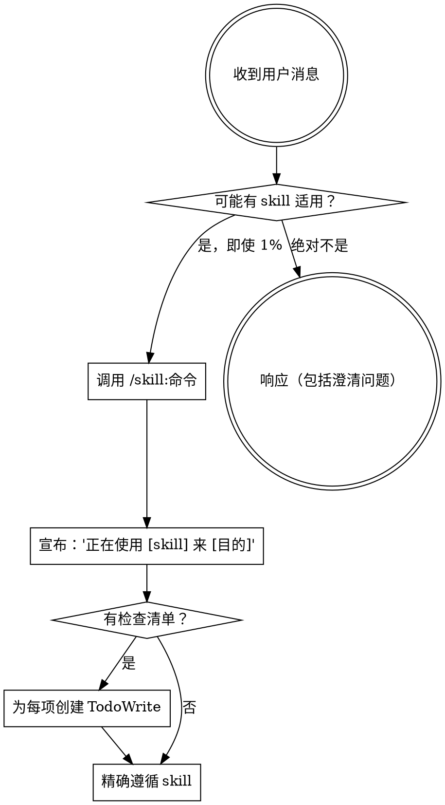

<极其重要>
如果你认为某个 skill 有哪怕 1% 的几率适用于你正在做的事情，你必须绝对调用该 skill。

如果某个 skill 适用于你的任务，你别无选择。你必须使用它。

这是不可协商的。这不是可选的。你不能用合理化来逃避。
</极其重要>

## 如何访问 Skills

**在 Kimi CLI 中：** 使用 `/skill:name` 命令。当你调用 skill 时，其内容会被加载并呈现给你——直接遵循它。不要对 skill 文件使用 Read 工具。

**在其他环境中：** 查看平台文档了解如何加载 skills。

# 使用 Skills

## 规则

**在做出任何响应或行动前先调用相关或请求的 skills。** 即使 skill 只有 1% 的几率适用，你也应该调用它来检查。如果调用的 skill 最终不适合该情况，你不需要使用它。

## 红旗

这些想法意味着停止——你在合理化：

| 想法 | 现实 |
|------|------|
| "这只是个简单问题" | 问题是任务。检查 skills。 |
| "我需要先了解更多上下文" | Skill 检查在澄清问题之前。 |
| "让我先探索代码库" | Skills 告诉你如何探索。先检查。 |
| "我可以快速检查 git/文件" | 文件缺乏对话上下文。检查 skills。 |
| "让我先收集信息" | Skills 告诉你如何收集信息。 |
| "这不需要正式 skill" | 如果 skill 存在，使用它。 |
| "我记得这个 skill" | Skills 会演变。阅读当前版本。 |
| "这不算任务" | 行动 = 任务。检查 skills。 |
| "这 skill 太过分了" | 简单事会变复杂。使用它。 |
| "我先做这个" | 在做任何事之前检查。 |
| "这感觉有成效" | 无纪律的行动浪费时间。Skills 防止这个。 |
| "我知道那是什么意思" | 知道概念 ≠ 使用 skill。调用它。 |

## Skill 优先级

当多个 skills 可能适用时，使用此顺序：

1. **流程 skills 优先**（头脑风暴、调试）- 这些决定如何接近任务
2. **实现 skills 其次**（前端设计、mcp-builder）- 这些指导执行

"让我们构建 X" → 先头脑风暴，然后实现 skills。
"修复这个 bug" → 先调试，然后领域特定 skills。

## Skill 类型

**严格型**（TDD、调试）：精确遵循。不要偏离纪律。

**灵活型**（模式）：根据上下文调整原则。

Skill 本身会告诉你属于哪种。

## 用户指令

指令说做什么，不是怎么做。"添加 X"或"修复 Y"不意味着跳过工作流。
