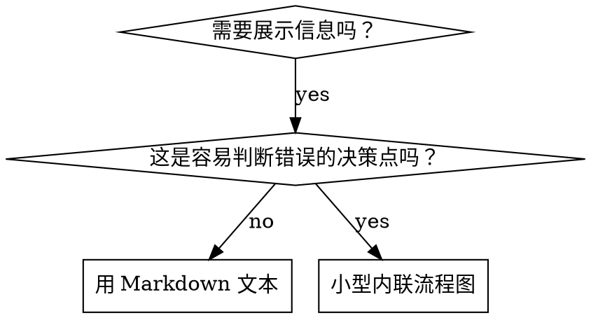

# 编写 Skills

## 概述

**编写 skills 就是将测试驱动开发应用于流程文档。**

个人 skills 存放在 agent 特定目录（`~/.config/agents/skills/` 或 `~/.kimi/skills/`）。

你编写测试用例（带子 agent 的压力场景），看着它们失败（基线行为），编写 skill（文档），看着测试通过（agent 遵守），然后重构（关闭漏洞）。

**核心原则：** 如果你没有看着 agent 在没有 skill 时失败，你就不知道 skill 是否教对了东西。

**必需背景：** 使用此 skill 前必须理解 `dev-tdd`。该 skill 定义了基本的红-绿-重构循环。此 skill 将 TDD 适配到文档。

## 什么是 Skill？

**skill** 是经过验证的技术、模式或工具的参考指南。Skills 帮助未来的 Kimi 实例找到并应用有效的方法。

**Skills 是：** 可重用技术、模式、工具、参考指南

**Skills 不是：** 关于你如何一次解决问题的叙述

## TDD 到 Skill 的映射

| TDD 概念 | Skill 创建 |
|-------------|----------------|
| **测试用例** | 带子 agent 的压力场景 |
| **生产代码** | Skill 文档（SKILL.md） |
| **测试失败（红）** | 没有 skill 时 agent 违反规则（基线） |
| **测试通过（绿）** | 有 skill 时 agent 遵守 |
| **重构** | 关闭漏洞同时保持遵守 |
| **先写测试** | 编写 skill 前运行基线场景 |
| **看着失败** | 记录 agent 使用的精确合理化 |
| **最小代码** | 编写解决那些特定违规的 skill |
| **看着通过** | 验证 agent 现在遵守 |
| **重构循环** | 找到新合理化 → 堵住 → 重新验证 |

整个 skill 创建过程遵循红-绿-重构。

## 何时创建 Skill

**创建时机：**
- 技术对你来说不是直观明显的
- 你会跨项目再次引用这个
- 模式广泛适用（不是项目特定）
- 其他人会受益

**不要为以下创建：**
- 一次性解决方案
- 其他地方有良好文档的标准实践
- 项目特定约定（放在 AGENTS.md 中）
- 机械约束（如果可用正则/验证强制执行，自动化它—文档用于判断调用）

## Skill 类型

### 技术
具体方法带步骤（条件等待、根本原因追踪）

### 模式
思考问题的方式（用标志扁平化、测试不变量）

### 参考
API 文档、语法指南、工具文档

## 目录结构

```
skills/
  skill-name/
    SKILL.md              # 主要参考（必需）
    supporting-file.*     # 仅需要时
```

**扁平命名空间** - 所有 skills 在一个可搜索命名空间中

**单独文件用于：**
1. **重参考**（100+ 行）- API 文档、综合语法
2. **可重用工具** - 脚本、工具、模板

**保持内联：**
- 原则和概念
- 代码模式（< 50 行）
- 其他所有东西

## SKILL.md 结构

**Frontmatter（YAML）：**
- 仅两个字段支持：`name` 和 `description`
- 最多 1024 字符总计
- `name`：仅使用字母、数字和连字符（无括号、特殊字符）
- `description`：第三人称，仅描述何时使用（不是做什么）
  - 以"何时使用..."开头聚焦触发条件
  - 包括具体症状、情况和上下文
  - **绝不总结 skill 的流程或工作流**
  - 可能的话保持在 500 字符内

```markdown
---
name: Skill-Name-With-Hyphens
description: 何时使用[具体触发条件和症状]
---

# Skill 名称

## 概述
这是什么？1-2 句话的核心原则。

## 何时使用
[小内联流程图 如果决定不明显]

带症状和用例的项目符号
何时不使用

## 核心模式（技术/模式用）
前后代码对比

## 快速参考
表格或项目符号用于扫描常见操作

## 实现
简单模式内联代码
重参考或可重用工具链接到文件

## 常见错误
什么出错 + 修复

## 真实影响（可选）
具体结果
```

## 创建 Skill 的搜索优化（CSO）

**对发现关键：** 未来的 Kimi 需要找到你的 skill

### 1. 丰富的描述字段

**目的：** Kimi 读取描述来决定为给定任务加载哪些 skills。让它回答："我应该现在读这个 skill 吗？"

**格式：** 以"何时使用..."开头聚焦触发条件

**关键：描述 = 何时使用，不是 Skill 做什么**

描述应该仅描述触发条件。绝不要总结 skill 的流程或工作流。

**为什么重要：** 测试显示，当描述总结工作流时，Kimi 可能遵循描述而不是阅读完整 skill 内容。说"任务间代码审查"的描述导致 Kimi 只做一次审查，尽管 skill 的流程图清楚显示两次审查（规范合规然后代码质量）。

当描述改为仅"何时使用..."（无工作流总结）时，Kimi 正确阅读流程图并遵循两阶段审查流程。

**陷阱：** 总结工作流的描述创建 Kimi 会走的捷径。skill 主体变成 Kimi 跳过的文档。

### 2. 关键词覆盖

使用 Kimi 会搜索的词：
- 错误消息："Hook 超时"、"ENOTEMPTY"、"竞态条件"
- 症状："不稳定"、"挂起"、"僵尸"、"污染"
- 同义词："超时/挂起/冻结"、"清理/拆卸/afterEach"
- 工具：实际命令、库名称、文件类型

### 3. 描述性命名

**使用主动语态，动词优先：**
- ✅ `creating-skills` 不是 `skill-creation`
- ✅ `condition-based-waiting` 不是 `async-test-helpers`

**遵循仓库命名前缀规范（`docs/skill-naming-convention.md`）：**
- 格式固定：`<category>-<name>`
- 分类前缀：`dev-`、`life-`、`work-`、`tool-`、`learn-`
- Skill 的 `name` 必须按用途选择前缀（开发类默认 `dev-`）

**名称与目录一致性：**
- skill 目录名应与 frontmatter `name` 一致
- 示例：目录 `dev-writing-skills/` 对应 `name: dev-writing-skills`

**避免：**
- 无前缀或前缀错误（如 `writing-skills`、`misc-helper`）
- 过于泛化（如 `tools`、`helper`、`utils`）
- 同一技能集合内命名风格不一致

### 4. 令牌效率（关键）

**问题：** 入门和频繁引用的 skills 加载到每个对话。每个令牌都重要。

**目标字数：**
- 入门工作流：每个 <150 字
- 频繁加载的 skills：总计 <200 字
- 其他 skills：<500 字（仍然简洁）

**技术：**

**移动详情到工具帮助：**
```bash
# ❌ 坏：在 SKILL.md 中记录所有标志
search-conversations 支持 --text、--both、--after DATE、--before DATE、--limit N

# ✅ 好：引用 --help
search-conversations 支持多种模式和过滤器。运行 --help 获取详情。
```

**使用交叉引用：**
```markdown
# ❌ 坏：重复工作流详情
搜索时，用模板分派子 agent...
[20 行重复指令]

# ✅ 好：引用其他 skill
总是使用子 agent（节省 50-100 倍上下文）。必需：使用 [other-skill-name] 工作流。
```

### 4. 引用其他 Skills

**当文档需要引用其他 skill：**

只使用 skill 名称，并明确标注是否强制依赖：
- ✅ 好：`**REQUIRED SUB-SKILL:** Use superpowers:test-driven-development`
- ✅ 好：`**REQUIRED BACKGROUND:** You MUST understand superpowers:systematic-debugging`
- ❌ 差：`See skills/testing/test-driven-development`（不清楚是否必需）
- ❌ 差：`@skills/testing/test-driven-development/SKILL.md`（会强制加载并消耗上下文）

**为什么不要 `@` 链接：** `@` 会立即加载文件，可能在真正需要前就消耗大量上下文。

## 流程图使用



**仅在以下场景使用流程图：**
- 非显而易见的决策点
- 容易过早停止的流程循环
- “何时用 A vs B”的分流判断

**不要用流程图表达：**
- 参考资料（改用表格/列表）
- 代码示例（改用 Markdown 代码块）
- 线性步骤（改用编号列表）
- 无语义标签（step1、helper2）

图形规范见 `graphviz-conventions.dot`。

**给人类协作者可视化：** 使用当前目录的 `render-graphs.js` 渲染 SVG：
```bash
./render-graphs.js ../some-skill
./render-graphs.js ../some-skill --combine
```

## 代码示例

**一个高质量示例胜过多个平庸示例。**

优先选最相关语言：
- 测试技术：TypeScript/JavaScript
- 系统调试：Shell/Python
- 数据处理：Python

**好示例应该：**
- 完整可运行
- 通过注释解释“为什么”
- 来自真实场景
- 清晰体现核心模式
- 可直接改造，不是空模板

**不要：**
- 同一示例实现 5+ 语言版本
- 写填空式模板
- 构造脱离实际的例子

## 文件组织

### 自包含 Skill
```
defense-in-depth/
  SKILL.md
```
适用：内容可全部内联，无重参考材料。

### 带可复用工具的 Skill
```
condition-based-waiting/
  SKILL.md
  example.ts
```
适用：需要可复用代码工具，而不只是叙述。

### 带重参考的 Skill
```
pptx/
  SKILL.md
  pptxgenjs.md
  ooxml.md
  scripts/
```
适用：参考材料过大，不适合内联。

## 铁律（与 TDD 相同）

```
没有先失败的测试，就没有 skill
```

这条规则同时适用于新建 skill 和修改既有 skill。

## Skill 的红-绿-重构

遵循 TDD 循环：

### 红：编写失败测试（基线）

不带 skill 运行带子 agent 的压力场景。记录精确行为：
- 他们做了什么选择？
- 他们使用了什么合理化（逐字）？
- 哪些压力触发了违规？

这是"看着测试失败" - 你必须在编写 skill 前看到 agent 自然做什么。

### 绿：编写最小 Skill

编写解决那些特定合理化的 skill。不要为假设情况添加额外内容。

用 skill 运行相同场景。Agent 现在应该遵守。

### 重构：关闭漏洞

Agent 找到新合理化？添加明确对策。重新测试直到防弹。

**测试方法学：** 详见 `testing-skills-with-subagents.md`，包含：
- 如何设计压力场景
- 压力类型（时间、沉没成本、权威、疲惫）
- 如何系统性补洞
- 元测试技巧

## 漏洞防护

需要执行纪律的 skills（如 TDD）需要抵抗合理化。Agent 很聪明，会在压力下找到漏洞。

**心理学补充：** 了解“为什么说服策略有效”有助于系统应用。研究基础见 `persuasion-principles.md`。

### 明确关闭每个漏洞

不要只陈述规则 - 禁止特定变通：

**坏：**
```markdown
先写代码再写测试？删除它。
```

**好：**
```markdown
先写代码再写测试？删除它。重新开始。

**没有例外：**
- 不要保留作为"参考"
- 不要写测试时"适配"它
- 不要看它
- 删除意味着删除
```

### 处理"精神 vs 文字"论点

早期添加基础原则：

```markdown
**违反规则的文字就是违反规则的精神。**
```

这切断整个"我遵循精神"合理化类别。

### 构建合理化表

从基线测试捕获合理化（见下文测试）。Agent 做的每个借口都进表：

```markdown
| 借口 | 现实 |
|--------|--------|
| "太简单不用测" | 简单代码也会坏。测试只需 30 秒。 |
| "我稍后测试" | 立即通过的测试证明不了什么。 |
| "稍后测试达到同样目标" | 稍后测试 = "这做什么？" 先测试 = "这应该做什么？" |
```

### 创建红旗列表

让 agent 容易自我检查何时在合理化：

```markdown
## 红旗 - 停止并重新开始

- 代码在测试前
- "已经手动测过了"
- "稍后测试达到同样目的"
- "是关于精神不是仪式"
- "这次不同因为..."

**所有这些意味着：删除代码。用 TDD 重新开始。**
```

### 更新 CSO 的违规症状

在 description 中加入“即将违规时”的触发症状，例如：

```yaml
description: Use when implementing any feature or bugfix, before writing implementation code
```

## 所有 Skill 类型的测试

不同 skill 类型需要不同测试方法：

### 纪律执行 Skills（规则/要求）

**示例：** TDD、完成前验证、设计前编码

**测试用：**
- 学术问题：他们理解规则吗？
- 压力场景：他们在压力下遵守吗？
- 多重压力组合：时间 + 沉没成本 + 疲惫
- 识别合理化并添加明确对策

**成功标准：** Agent 在最大压力下遵循规则

### 技术 Skills（操作指南）

**示例：** 条件等待、根本原因追踪、防御性编程

**测试用：**
- 应用场景：他们能正确应用技术吗？
- 变化场景：他们处理边界情况吗？
- 缺失信息测试：指令有缺口吗？

**成功标准：** Agent 成功应用技术到新场景

### 模式 Skills（心智模型）

**示例：** 降低复杂性、信息隐藏概念

**测试用：**
- 识别场景：他们识别模式何时适用吗？
- 应用场景：他们能使用心智模型吗？
- 反例：他们知道何时不适用吗？

**成功标准：** Agent 正确识别何时/如何应用模式

### 参考 Skills（文档/API）

**示例：** API 文档、命令参考、库指南

**测试用：**
- 检索场景：他们能找正确信息吗？
- 应用场景：他们能正确使用找到的吗？
- 缺口测试：常见用例被覆盖吗？

**成功标准：** Agent 找到并正确应用参考信息

## 跳过测试的常见合理化

| 借口 | 现实 |
|--------|--------|
| "Skill 显然清晰" | 对你清晰 ≠ 对其他 agent 清晰。测试它。 |
| "只是参考" | 参考可能有缺口、不清楚的章节。测试检索。 |
| "测试是过度" | 未测试的 skills 有问题。总是。15 分钟测试节省数小时。 |
| "问题出现再测试" | 问题 = agent 不能用 skill。部署前测试。 |
| "测试太繁琐" | 测试比生产环境调试坏 skill 更不繁琐。 |
| "我有信心它好" | 过度自信保证问题。反正测试。 |
| "学术审查就够了" | 阅读 ≠ 使用。测试应用场景。 |
| "没时间测试" | 部署未测试 skill 以后浪费更多时间修复。 |

**所有这些意味着：部署前测试。没有例外。**

## 反模式

### ❌ 叙述示例
"在 2025-10-03 会话中，我们发现空 projectDir 导致..."
**为什么坏：** 太具体，不可重用

### ❌ 多语言稀释
example-js.js、example-py.py、example-go.go
**为什么坏：** 质量平庸，维护负担

### ❌ 流程图中代码
```dot
step1 [label="import fs"];
step2 [label="read file"];
```
**为什么坏：** 无法复制粘贴，难读

### ❌ 通用标签
helper1、helper2、step3、pattern4
**为什么坏：** 标签应该有语义意义

## 移动到下一个 Skill 前停止

**编写任何 skill 后，你必须停止并完成部署过程。**

**不要：**
- 批量创建多个 skills 而不测试每个
- 当前 skill 验证前移向下一个 skill
- 跳过测试因为"批量更有效"

**下面的部署清单对每个 skill 是强制性的。**

部署未测试 skills = 部署未测试代码。违反质量标准。

## Skill 创建清单（TDD 适配）

**重要：使用 TodoWrite 为下面每个清单项创建 todos。**

**红阶段 - 编写失败测试：**
- [ ] 创建压力场景（纪律 skills 3+ 组合压力）
- [ ] 不带 skill 运行场景 - 逐字记录基线行为
- [ ] 识别合理化/失败模式

**绿阶段 - 编写最小 Skill：**
- [ ] 名称仅使用字母、数字、连字符（无括号/特殊字符）
- [ ] 名称符合 `docs/skill-naming-convention.md`：`<category>-<name>`，前缀按用途选择
- [ ] YAML frontmatter 仅 name 和 description（最多 1024 字符）
- [ ] skill 目录名与 frontmatter `name` 完全一致
- [ ] Description 以"何时使用..."开头，包括具体触发器/症状
- [ ] Description 第三人称书写
- [ ] 全文关键词用于搜索（错误、症状、工具）
- [ ] 清晰概述带核心原则
- [ ] 解决红阶段识别的具体基线失败
- [ ] 代码内联或链接到单独文件
- [ ] 一个优秀示例（非多语言）
- [ ] 用 skill 运行场景 - 验证 agent 现在遵守

**重构阶段 - 关闭漏洞：**
- [ ] 从测试识别新合理化
- [ ] 添加明确对策（如果是纪律 skill）
- [ ] 从所有测试迭代构建合理化表
- [ ] 创建红旗列表
- [ ] 重新测试直到防弹

**质量检查：**
- [ ] 仅如果决定不明显时小流程图
- [ ] 快速参考表
- [ ] 常见错误章节
- [ ] 无叙述讲故事
- [ ] 仅工具或重参考的支持文件

**部署：**
- [ ] 提交 skill 到 git 并推送到你的 fork（如果配置）
- [ ] 如果具备通用价值，考虑提交 PR 回馈上游

## 发现工作流

未来 agent 通常会这样找到你的 skill：

1. 遇到问题（例如“测试不稳定”）
2. 在可用 skills 中检索
3. 命中描述（description 匹配）
4. 快速扫读概述（判断相关性）
5. 读取模式与快速参考
6. 仅在实现时加载示例文件

**优化方向：** 让可检索关键词尽量前置且重复出现。

## 底线

**创建 skills 就是文档的 TDD。**

同样的铁律：没有先有失败测试就没有 skill。
同样循环：红（基线）→ 绿（编写 skill）→ 重构（关闭漏洞）。
同样好处：更好质量、更少意外、防弹结果。

如果你为代码遵循 TDD，为 skills 也遵循。它是应用于文档的同样纪律。
